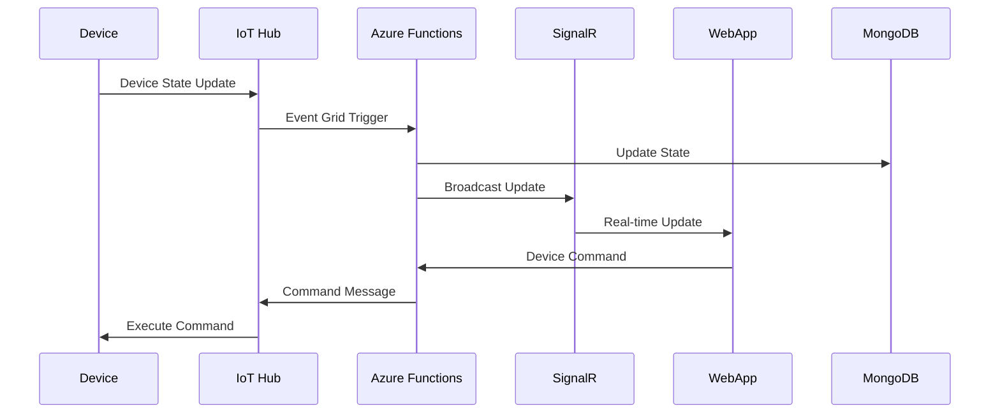

# SmartHome Technical Documentation
---
[TOC]

---
## **1. Executive Summary**

### Purpose

The *SmartHome* project aims to provide a cloud-based IoT solution that enables users to remotely control and monitor their home devices in real-time through a web application. The system offers a secure, scalable, and responsive platform for smart home automation.

### Project Scope

- 🔐 User Authentication & Security
- ⚡ Real-Time Device Control 
- 🏠 Home Management System
- 🔄 IoT Device Integration

> [!IMPORTANT]
>
> Not In Scope
> ❌ Mobile Applications  
> ❌ Hardware Manufacturing  
> ❌ Third-party IoT Platforms Integration  
> ❌ Voice Control Features  
> ❌ AI/ML Implementation

#### Project Backlog - Core Features

| Epic                       | Story                                      | Priority | Sprint |
| -------------------------- | ------------------------------------------ | -------- | ------ |
| **Application Deployment** |                                            |          |        |
| QT5-46                     | Deploy Angular Full-Stack Web App to Azure | Medium   | 3      |
| **User Authentication**    |                                            |          |        |
| QT5-8                      | Register Account                           | Medium   | 2      |
|                            | Login to Application                       | High     | 2      |
| **Device Control**         |                                            |          |        |
| QT5-5                      | Send Commands to Arduino                   | Medium   | 3      |
|                            | Receive JSON from Arduino                  | Medium   | 3      |
|                            | Real-time Device State Updates             | Medium   | 2      |
| **Infrastructure**         |                                            |          |        |
| QT5-17                     | Connect MongoDB Database                   | High     | -      |
|                            | Implement SignalR                          | Medium   | 2      |
|                            | Create Event Grid/Azure Function           | High     | 2      |
| **User Experience**        |                                            |          |        |
| QT5-38                     | Form Implementation                        | Medium   | 3      |
|                            | Add Homes/Rooms/Devices                    | Medium   | 2      |

A detailed export of the Jira backlog is available [here](https://helbprigogineeu-my.sharepoint.com/:x:/g/personal/lcalvocastano_helb-prigogine_be/ESyUca8cErpIoW_8XHHJTt8B96AElDXqN4c4nvghfabXbw?e=id4HdE).

### Audience 

This technical documentation is intended for the following key stakeholders:

- **Mr. Ghassan Farah**: Orange client representative.
- **Mr. Soufyan Lemniai**: Scrum master.
- **Mr. Matthieu Schuermans**: Scrum master.
- **Ms. Alisia Temerbek**: English and communication quality advisor.

#### Technical Team

This documentation is also intended for all developers, project managers, and anyone who will be using or maintaining the system. It provides essential information on system design, implementation, and maintenance to ensure smooth operation and effective troubleshooting.

---

## **2. System Overview**

### Problem Statement

Modern homes increasingly demand efficient and centralized solutions to manage Internet of Things (IoT) devices. However, current systems often lack real-time control, seamless multi-home management, and robust security. Users face challenges such as:

- Remote operation and monitoring of devices
- Real-time updates on device states
- Management of multiple homes, rooms, and devices
- Ensuring secure and scalable access to IoT networks

### Solution Highlights

The *SmartHome* system provides an innovative, cloud-based IoT solution that leverages Microsoft Azure services and modern web technologies. This serverless and real-time platform addresses the core requirements of remote control, real-time monitoring, and secure data handling.

#### Key Components of the Solution

- **Azure IoT Hub**: Acts as a central point for communication between IoT devices and the cloud, enabling reliable and scalable device integration.
- **Azure Functions**: Processes and orchestrates messages between IoT Hub, SignalR, and the database, ensuring a seamless data flow.
- **SignalR**: Manages real-time updates, facilitating instantaneous communication between users and devices.
- **Web App**: Provides a responsive and intuitive user interface for managing IoT devices and homes remotely.

### Context Diagram of the Solution


---

## **3. Architecture Overview**

### Logical Architecture Overview

The *SmartHome* system follows a microservices and serverless architecture pattern. It integrates IoT devices with cloud services to deliver real-time, secure, and scalable smart home automation capabilities. The architecture leverages Microsoft Azure's rich ecosystem to seamlessly handle device communication, data processing, and user interaction.

The system comprises five key containers:

1. **Azure IoT Hub**: Serves as the gateway for IoT devices through MQTT protocol. It enables secure and scalable communication.
2. **Azure Functions**: Manages serverless event processing, device orchestration, and integration with other services.
3. **SignalR**: Enables real-time notifications and updates for users via WebSocket connections.
4. **MongoDB**: Stores structured IoT data for device state, user configurations, and logs.
5. **Web App**: A responsive Angular-based interface for users to manage homes, rooms, and IoT devices in real-time.

### Container Diagram


---

## **4. Detailed Component Design**

### Components Description
- **IoT Devices**: Edge devices sending telemetry data.
- **Azure IoT Hub**: Manages device communication.
- **Azure Functions**: Processes data and triggers real-time updates.
- **SignalR Service**: Enables real-time updates to the web app.
- **Web Application**: User-facing dashboard for monitoring and control.

### IoT Devices
- Protocols: MQTT, AMQP, or HTTP.
- Data format: JSON.

### Azure IoT Hub
Azure IoT Hub serves as the central communication hub between IoT devices and the cloud. It enables device provisioning, authentication, and seamless message routing.

- **Device Provisioning and Authentication**: IoT Hub supports secure device connections using shared access signatures, X.509 certificates, or device identity tokens. This ensures devices are authenticated and authorized before exchanging data.
- **Message Routing and Telemetry Ingestion**: Incoming telemetry data from devices is routed based on predefined rules. IoT Hub integrates seamlessly with Azure Event Grid, Azure Functions, and other services for processing and analytics.

### Azure Functions

This section provides a technical breakdown of the Azure Functions implemented in the `EventGridTriggerT5` class. These functions are critical to enabling device communication, real-time updates, and client connectivity.


#### ReceiveFromDevice

- **Trigger**: This function is triggered by an Event Grid event containing telemetry data sent by IoT devices.
- **Parameters**:
  - `EventGridEvent eventGridEvent`: The payload received from Azure Event Grid, containing data from the IoT Hub.
- **Functionality**:
  1. Extracts the `Data` property from the `EventGridEvent` payload and deserializes it into a JSON object.
  2. Checks for the presence of a `body` property in the deserialized JSON. If absent or empty, logs an informational message and terminates execution.
  3. If valid data is present in the `body`, sends the telemetry data to all connected clients through SignalR using the `ReceiveTelemetry` event.
- **Error Handling**:
  - Logs errors encountered during JSON deserialization or data processing.
- **Integration**:
  - Bridges IoT devices and the SignalR clients (e.g., Angular web app) by transmitting telemetry data in real-time.

#### SendToDevice

- **Trigger**: Triggered via an HTTP POST request to send commands to a specific IoT device.
- **Parameters**:
  - `HttpRequestData req`: The HTTP request containing the JSON payload with command details.
- **Functionality**:
  1. Reads the request body and deserializes it into an `IotDeviceMessage` object. If the body is empty or deserialization fails, returns a `400 Bad Request` response.
  2. Constructs an Azure IoT Hub message using the deserialized payload. The message is encoded as JSON with UTF-8 encoding.
  3. Sends the constructed message to the IoT Hub for delivery to the specified device using the `DeviceId` property.
  4. Logs a success message upon successful delivery and responds with `200 OK`. In case of failure, logs the error and returns a `500 Internal Server Error` response.
- **Error Handling**:
  - Validates the request body and provides detailed error responses for missing or invalid payloads.
  - Logs and returns detailed errors for any failures during message sending.
- **Integration**:
  - Facilitates two-way communication by allowing the Angular web app to send commands to IoT devices via the IoT Hub.

#### Negotiate

- **Trigger**: Triggered via an HTTP POST request to provide SignalR connection details to clients.
- **Parameters**:
  - `HttpRequestData req`: The HTTP request triggering the function.
- **Functionality**:
  1. Retrieves the SignalR endpoint URL for the `deviceHub` hub using the `IServiceManager` API.
  2. Generates a client access token for the `deviceHub` hub using the `GenerateClientAccessToken` method.
  3. Constructs a JSON response containing the SignalR endpoint URL and the access token.
  4. Returns the response with a `200 OK` status.
- **Error Handling**:
  - Catches exceptions during SignalR endpoint retrieval or token generation, logs the error, and returns a `500 Internal Server Error` response.
- **Integration**:
  - Ensures that the Angular web app can establish secure connections to SignalR for real-time updates.


### SignalR Service

The SignalR service is tightly integrated with the `ReceiveFromDevice` and `Negotiate` functions to enable real-time communication between the web application and the backend.

- **Broadcasting**: The `ReceiveFromDevice` function sends telemetry updates to all connected clients using the `ReceiveTelemetry` event.
- **Connection Management**: The `Negotiate` function generates access tokens, ensuring secure and authenticated client connections to SignalR.
- **Scalability**: SignalR dynamically handles large numbers of simultaneous client connections and maintains high performance under load.


### Web Application
- **Framework**: Angular with Typescript (Frontend), .NET with C# (Backend)
- **Architecture**: Full-stack application with separation of concerns, integrating SignalR for real-time communication.
Both Backend and Frontend launch at the same time.


#### Frontend (Angular)

- **Language**: Typescript
- **Features**:
  - **Login Page**: Secure authentication using the `User` model and crypted Passwords.
  - **Main Dashboard**:
    - Displays all homes, rooms, and devices associated with the logged-in user.
    - Device toggling functionality with real-time updates being sent to all connected clients.
  - **Forms**:
    - Separate forms on the web page for adding:
      - **Homes**: Associates new homes with the user.
      - **Rooms**: Assigns rooms to specific homes.
      - **Devices**: Maps devices to selected homes and rooms.
    - Automatic ID generation for each added home, room, and device.
- **Real-time Features**:
  - Toggle devices via UI in real-time.
  - Integration with SignalR within the Web App and from/to the Azure Function for instant updates on any device state change.

#### Backend (.NET with C#)

- **Architecture**:
  - Well-structured code for easy maintainability with seperation of concerns with Controllers and Services for each Model, and a dedicated  SignalR hub class, and a HubContext to communicate with the MongoDB NoSQL Database.
- **Features**:
  - **CRUD Operations**: Create, read, update, and delete operations for models:
    - User
    - Home
    - Room
    - Device
  - **Device Toggling**:
    - `Device` model includes a toggle feature to change device states from **On** to **Off**.
    - Sends the IDs of selected home, room, and device to Azure Functions in **JSON** format.
  - **Integration with SignalR**:
    - Enables real-time updates for frontend device toggling.
    - Communication with the Azure Function for sending adapted **JSON** payloads to **IoT Hub**.

### Database (MongoDB)


- **Structure**:
  - **Collections**:
    - `Users`, `Homes`, `Rooms`, and `Devices`.
    - `USER` collection collecting the entire database of the application with all of the above.

- **Design**:
    - Simple `NoSQL architecture` in `BSON` format (similar to `JSON`).

- **Data Flow**:
  - Toggled devices are immediately reflected in the database and the frontend through SignalR. See below for data flow in details.

#### Azure Integration

> REM: Pk encore azure functions ?

- **Azure Functions**:
  - Processes data when devices are toggled from the frontend.
  - Adapts JSON payloads to match the IoT Hub's expected format for communication with Arduino devices.
  - **`Rising issues`**:
    - JSON compatibility mismatch between the app's payload and the Arduino configuration.
    - Requires manual intervention to update the JSON format in IoT Hub or Arduino settings.
- **SignalR**:
  - Facilitates instant feedback between frontend and backend upon device state changes from the IoT Device and vice-versa.

### Summary

> REM: Summary et ce contenu vrmnt utile ici ?

This SmartHome web application provides a user-friendly and elegant interface for managing smart home configurations. It enables dynamic control of homes, rooms, and devices, using Angular for the frontend and .NET for backend logic. Real-time updates via SignalR ensure the state of the devices are kept updated, while integration with the Azure Function allows communication with the IoT Hub. 

>  [!NOTE]
>
> Addressing current compatibility issues will unlock the full potential of the system

---

## **5. Data Flow**



### JSON Message Structure

Upon toggling of any device, this is an example of the content of the JSON Payload that will be integrated through the Arduino's JSON:

```json
{
  "userId": "67754122ff97e995b6c1b44a",
  "homeId": "SmartHome",
  "roomId": "1",
  "deviceId": "2",
  "state": true,
}
```

To avoid modifying the entire Database after each device toggle, the Web App was designed early on so that only the ID's of the selected User, Home, Room and Device, along with the state of that device to be transfered to the IoT Hub through the Azure Function. Unfortunately, the JSON payload from the Arduino contains the entire database, and was communicated in the last week of the project, which made seamless integration between the Web App and the Arduino quite difficult.

### Database Schema

**Example of `helb` user:**
```json
    {
        "UserId": "67754122ff97e995b6c1b44a",
        "Name": "helb",
        "Email": "helb@gmail.com",
        "Password": "$2a$11$rtNIAo3G4HpPCngnTpWfIOy0BMQaRFVsv0icH4nx33WeerSl9WWeq",
        "Homes": [
            {
                "HomeId": "SmartHome",
                "Nickname": "Smart Home",
                "Address": "Brussels",
                "Rooms": [
                    {
                        "RoomId": "1",
                        "Name": "Living Room",
                        "Devices": [
                            {
                                "DeviceId": "1",
                                "Description": "Light",
                                "State": false
                            },
                            {
                                "DeviceId": "2",
                                "Description": "Socket",
                                "State": true
                            }
                        ]
                    },
                    {
                        "RoomId": "2",
                        "Name": "Kitchen",
                        "Devices": [
                            {
                                "DeviceId": "1",
                                "Description": "Light",
                                "State": true
                            },
                            {
                                "DeviceId": "2",
                                "Description": "Socket",
                                "State": false
                            }
                        ]
                    }
                ]
            }
        ]
    }
```

---

## **6. Application Security**

The application implements several security measures:
- Session-based authentication
- HTTPS communication
- Azure IoT Hub device authentication
- Input validation and sanitization

---
## **7. Deployment Architecture**

> TODO: Enhance with Elie's information ? 

### Environment Setup

1. Azure Resources:
   - IoT Hub
   - Function App
   - SignalR Service
   - MongoDB Atlas

2. Development Environment:
   - Visual Studio 2022
   - .NET 8.0 SDK
   - Node.js and Angular CLI
   - Azure Functions Core Tools

---

## **8. Monitoring and Maintenance**

### Known Issues and Challenges

1. **IoT JSON Compatibility**:
   - The JSON payload sent from the web application to the IoT Hub does not align with the expected format in the client-defined Arduino setup.
   - **Impact**: This misalignment causes communication errors, requiring manual intervention to adapt the payload structure for successful toggling.
   - **Possible Solution**: Develop a middleware service to standardize JSON mapping dynamically between the web app and the IoT Hub.

2. **Device Registration**:
   - Newly generated IDs for homes, rooms, and devices in the web app need to be manually registered in the IoT Hub or Arduino configuration or vice-versa (meaning, modifying the IDs of the objects within MongoDB manually).
   - **Impact**: This manual process is prone to errors and increases setup time for users.

3. **Database Synchronization with JSON Payloads**:
   - When the Arduino sends a JSON payload containing the states of multiple rooms and devices simultaneously, the frontend processes the data to update the MongoDB database.
   - **Issue**: Database updates occur randomly due to asynchronous handling, leading to incorrect devices being toggled.
   - **Solution**:
     - Implement robust asynchronous handling mechanisms to process devices one by one.
     - Introduce transaction-like operations or atomic updates in MongoDB to ensure consistency during batch updates.

### Maintenance Tasks

1. **Routine Testing**:
   - Often verify JSON compatibility between the web app, IoT Hub, and Arduino configurations.
   - Test device toggling to ensure proper database updates and state changes.

2. **Database Optimization**:
   - Refactor database update logic to handle simultaneous payloads asynchronously without causing conflicts.

3. **Azure Portal Configuration**:
   It might be necessary to configure the Azure Portal in any changes of the used Database, IoT Hub, changing the domain name of the current port of the localhost, etc.. 
   Here are the steps to keep these checked:
   - **Connection String**:
     - Navigate to the Azure portal to your Azure Function and to your Web App.
     - Select `environment variable`, and locate the resource you want to change/add.
     - Copy the connection string from the "Connection Strings" section and apply changes.
     - Also update the connection string in the backend's configuration file (e.g., `appsettings.json` or an environment variable).
   - **CORS Settings**:
     - For each Azure resource that requires CORS (e.g., SignalR, Azure Function, IoT Hub):
       1. Navigate to the "CORS" settings section of the resource.
       2. Add the allowed origins:
          - For local development: `http://localhost:4200`
          - For production: Add the domain name of the hosted web app (e.g., `https://yourdomain.com`).
       3. Save the changes to enable cross-origin requests.

4. **Future Improvements**:
   - Automate JSON mapping for seamless compatibility, if possible.
   - Develop tools for ID synchronization and eliminate manual registration steps, if possible.

## **9. Appendix**

### References

- [Azure IoT Hub Documentation](https://docs.microsoft.com/en-us/azure/iot-hub/)
- [Azure Functions Documentation](https://docs.microsoft.com/en-us/azure/azure-functions/)
- [SignalR Documentation](https://docs.microsoft.com/en-us/aspnet/core/signalr/)
- [MongoDB Documentation](https://docs.mongodb.com/)

### Attachments 

---

### Team Members

- Alain M. Nitunga
- Elie Kheirallah
- Farouk Ait Oujkal
- Jamal Assou
- Léo Calvo Castaño
