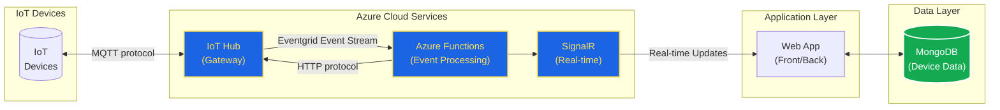
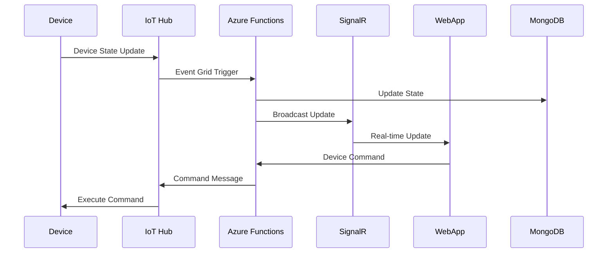

# SmartHome Technical Documentation

> [!TODO]
>
> Retirer de la doc:

COULEURS MERMAID:

``````
classDef azure fill:#1B65E5,stroke:#FFDE59,stroke-width:2px,color:#FFDE59
classDef database fill:#13AA52,stroke:#FFF,stroke-width:2px,color:#FFF
``````

## 1. Executive Summary

### Purpose

The *SmartHome* project aims to provide a cloud-based IoT solution that enables users to remotely control and monitor their home devices in real-time through a web application. The system offers a secure, scalable, and responsive platform for smart home automation.

### Project Scope

- 🔐 User Authentication & Security
- ⚡ Real-Time Device Control 
- 🏠 Home Management System
- 🔄 IoT Device Integration

> [!IMPORTANT]
>
> Not In Scope
> ❌ Mobile Applications  
> ❌ Hardware Manufacturing  
> ❌ Third-party IoT Platforms Integration  
> ❌ Voice Control Features  
> ❌ AI/ML Implementation

## 2. System Overview

### Problem Statement

Modern homes require smart automation solutions that allow users to:

- Control devices remotely
- Monitor device states in real-time
- Manage multiple homes and rooms
- Ensure secure access to their devices

### Solution Highlights

The solution leverages several Azure services and modern web technologies:

``````mermaid
graph LR
    De[IoT Devices] <-->|via IoT Hub| Af[Azure Functions]
    Af -->|via SignalR| Wa[Web Application]
    Wa -->|Device Commands| Af
    Wa <-->|Collections Management| Md[(MongoDB)]

	classDef azure fill:#1B65E5,stroke:#FFDE59,stroke-width:2px,color:#FFDE59
	classDef database fill:#13AA52,stroke:#FFF,stroke-width:2px,color:#FFF
	
	class Af azure
	class Md database
``````

| Azure IoT Hub                                                | Azure Functions                                              | SignalR                                                      |
| ------------------------------------------------------------ | ------------------------------------------------------------ | ------------------------------------------------------------ |
| Manages bi-directional communication between devices and cloud | Handles device state changes and manages communication between IoT Hub and SignalR | Enables real-time communication between the web application and cloud services |

## 3. Architecture Overview

### Logic Architecture Diagram
The system follows a microservices architecture pattern, integrating IoT devices, cloud services, and web applications.



### Container Description

#### Azure IoT Hub
- **Purpose**: Manages IoT device communication
- **Features**:
  - Device registration
  - Message routing
  - Device twins
  - Security management
- **Configuration**: Configured in West Europe region with standard tier

#### Azure Functions
- **Implementation**: .NET 8.0
- **Triggers**: 
  - HTTP triggers for API endpoints
  - Event Grid triggers for IoT events
- **Key Functions**:
  - ReceiveFromDevice
  - SendToDevice
  - Negotiate (SignalR)

#### SignalR
- **Purpose**: Real-time communication
- **Features**:
  - WebSocket support
  - Fallback to long polling
  - Client groups
  - Connection management
- **Integration**: Azure SignalR Service

#### WebApp
- **Framework**: Angular 
- **Features**:
  - User authentication
  - Device control interface
  - Real-time updates
  - Responsive design

#### MongoDB
- **Purpose**: Data persistence
- **Collections**:
  - Users
  - Homes
  - Rooms
  - Devices
- **Schema**: Document-based with nested objects

## 4. Detailed Component Design

> [!TODO]
>
> CAN BE DONE WITH STRUCTURIZR COMPONENT DIAGRAM
>
> COMPONENTS AND HOW DO THEY INTERACT WITH EACH OTHERS? 
>
>  - AZURE IOT HUB
>  - AZURE FUNCTIONS
>  - SIGNALR
>  - WEBAPP

## 5. Data Flow

### 


### JSON Message Structure
Device State Message:
```json
{
  "deviceId": "device123",
  "homeId": "home456",
  "roomId": "room789",
  "state": true,
  "timestamp": "2024-12-15T10:00:00Z"
}
```

### Database Schema
```json
{
  "user": {
    "userId": "string",
    "email": "string",
    "password": "string",
    "homes": [
      {
        "homeId": "string",
        "nickname": "string",
        "rooms": [
          {
            "roomId": "string",
            "name": "string",
            "devices": [
              {
                "deviceId": "string",
                "description": "string",
                "state": "boolean"
              }
            ]
          }
        ]
      }
    ]
  }
}
```

## 6. Application Security

The application implements several security measures:
- Session-based authentication
- HTTPS communication
- Azure IoT Hub device authentication
- Input validation and sanitization

## 7. Deployment Architecture

> [!TODO]
>
> Github h3
>
> - smarthome web app
>   - subdirectoy Client --> angular frontend project
>   - subdirectory Server --> angular backend project
> - azure function http trigger (keep it because could be necessary if problems with eventgrid)
> - azure function eventgrid trigger

### Environment Setup

1. Azure Resources:
   - IoT Hub
   - Function App
   - SignalR Service
   - MongoDB Atlas

2. Development Environment:
   - Visual Studio 2022
   - .NET 8.0 SDK
   - Node.js and Angular CLI
   - Azure Functions Core Tools

## 8. Appendix

### References
- [Azure IoT Hub Documentation](https://docs.microsoft.com/en-us/azure/iot-hub/)
- [Azure Functions Documentation](https://docs.microsoft.com/en-us/azure/azure-functions/)
- [SignalR Documentation](https://docs.microsoft.com/en-us/aspnet/core/signalr/)
- [MongoDB Documentation](https://docs.mongodb.com/)

### Attachments 

> [!Important]
>
> -- Attach the code of the azure function
> ---- Complete code or part of it, as file with reference link or in code block ?

> [!IMPORTANT]
>
> Code Samples necessary if already explained before in documentation

### Team Members
- Alain M. Nitunga
- Elie Kheirallah
- Farouk Ait Oujkal
- Jamal Assou
- Léo Calvo Castaño